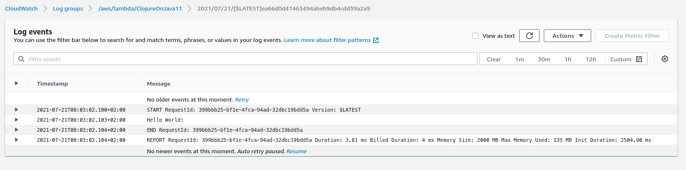

# Minimal reproduction for #2787

Reproduction is based on official AWS guide for [Clojure](https://aws.amazon.com/blogs/compute/clojure/)
and proves the regression in AWS SAM rapid Java runtime. The code has been successfully deployed on AWS, and it's working with no reasonable doubt. I'm attaching the screenshot of working stack for completness of the report.

## Clojure/Java 11 on AWS Lambda


## Clojure/Java 8 on AWS Lambda


# Prerequisites
  - Leiningen (either from source https://leiningen.org/#install or using brew)
  - SDKMan & Java8/Java11 installed (effortless Java switch)
  - Standard Make util

# Test
  Run:
  
  ```
  make test
  ```

# Deployment
  Run:
  
  ```
  make deploy
  ```
# Destroy 
  Run:
  
  ```
  make destroy
  ```
